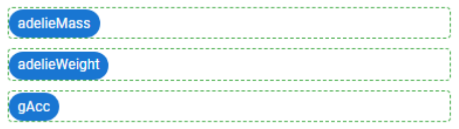

.. _uxMatricesColumns:

Matrices and columns
====================

Matrices are subdivisions of :ref:`groups <uxGroups>`.
Each matrix contains one or more columns.
In most cases, a matrix will contain one column and that column will contain one :ref:`block <uxBlocksSummary>`.
There are no special guidelines relating to single-column, single-block matrices.  

    A good use of multiple columns inside a matrix.

Multi-column matrices
---------------------

You can place up to four columns side by side inside a matrix.
Additionally, the columns' widths are adjustable.

[TODO another example like this schema or similar]
X x x
X    x
X    x

When to use multi-column matrices
^^^^^^^^^^^^^^^^^^^^^^^^^^^^^^^^^

Multi-column matrices are of great relevance when two or more variables share some deep relationship (consider pairs of coordinates, or a chemical compound's coefficient and concentration).
In such a case, it makes sense to place them in the same matrix.

* Use it when two or more variables share a horizontal relationship.
* Use it when two or more variables are deeply connected, but with a hierarchy: in this case, consider changing the proportion of the width of each column! 
* Use it in the case of a mathematical matrix to provide the user with a grid-like set of inputs.

Considerations
^^^^^^^^^^^^^^

The bottom of a matrix is the anchor point for :ref:`conditions' error messages<uxConditions>`.
If multiple variables have errors, they will be shown beneath the matrix, and not directly beneath their “host” variable block.
Therefore, you should engineer your conditions so that you don't create redundant information for the user.

Be aware of using the multicolumn layout in the presence of lengthy units/prefixes/suffixes --- the space available for the inputs shrink.

Long labels might wrap (even multiple times) in a multicolumn layout, which may look ugly and lead to a bad UX.

As the multicolumn layout should be used for inputting values for one conceptual object (e.g. a pair of coordinates), there should be only one help text for the entire multi-column layout.

Stacking blocks in columns
--------------------------

A column can contain multiple blocks, where they would be stacked vertically.
This approach lets you add depth to the layout of your tools by placing content side-by-side with different heights.

When to use stacked blocks
^^^^^^^^^^^^^^^^^^^^^^^^^^

Employ multi-block columns sparingly.
Their use should be limited to cases where a block with a large height must be placed on one side of the tool, such as an image or some text.
In this case, the blocks on the other side (often variable blocks) may be stacked.

[TODO new image example]

Avoid
^^^^^

.. image:: images/stackedBad.png
    :alt: Two matrices, with one matrix containing one double-block column.
    :width: 49%

*Avoid multiple blocks in a single-column matrix.
The left example below shows poor use of columns, while the right example is proper.*

    
    Avoid side-by-side columns exclusively populated by variable blocks.

Considerations
^^^^^^^^^^^^^^

As the error message from a condition shows underneath the matrix, not underneath the block, this layout is the only instance of disjunction between a variable block and a condition error message.
For this reason, you must limit it to cases where it's unavoidable!