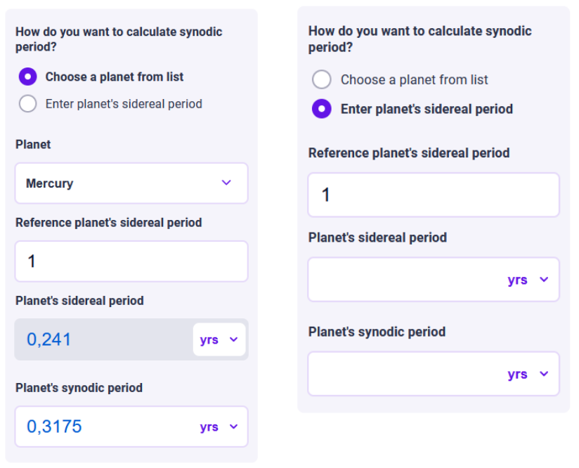

Value select types
==================

Value selects can be presented in one of three visual styles, called “value select types”.
There are three of these types:

* :ref:`Dropdown list <uxDropdown>`
* :ref:`Radio button <uxRadioButtons>`
* :ref:`Checkbox <uxCheckbox>`

There are some guidelines for appropriate usage of each type --- these are listed below.

.. _uxDropdown:

Dropdown list
-------------

A dropdown list displays a set of options from which the user can select one.
The list is only displayed when the user clicks on it.
Therefore, using a dropdown list leads to some information being hidden, which the user has to go find.

When to use a dropdown list
^^^^^^^^^^^^^^^^^^^^^^^^^^^

* When the user is choosing from a list of items that have the same "weight"/importance and are not changing the calculations (the value select acts purely as input to calculations, such as selecting a penguin species).

* When there is a large number of options, specifically five or more.

  * Exception: when we want to set a default option, and that option is way more probable than the others. Then we can use a dropdown list for less than 5 items.

* When the user doesn't need to see all options to be sufficiently informed.

Default values for dropdown lists
^^^^^^^^^^^^^^^^^^^^^^^^^^^^^^^^^

Because of how the dropdown list is visually represented in the calculator, the user may not realize that they can open the dropdown menu.
It is therefore important to give dropdown lists a default value.
Consult the previous section [TODO link?] to determine which option is best suited to being the default.
If none fit the requirements, pick the first option in the list.

.. _uxRadioButtons:

Radio buttons
-------------

Radio buttons show all the options at once.

* Try not to create radio buttons with more than 5 options. When we want to set a default option, and that option is way more probable than the others, we can use a dropdown list for fewer than five items.
* When simply adding an additional value use a checkbox.

A default value is not necessary for a radio button (but can still be valuable depending on the use-case).

  
  The synodic period calculator allows the user to specify whether they want to select a known planet and use its sidereal period, or to input the period directly.

.. _uxCheckbox:

Checkbox
--------

When to use a checkbox
^^^^^^^^^^^^^^^^^^^^^^

* When a user adds an item with additional variables to the calculation.

    .. figure:: images/checkboxTomato.png
      :alt: A checkbox labelled "flour" that triggers the visibility of a section allowing the user to enter data specific to their use of flour in a recipe.
      :align: center
      :width: 50%

      Example: when the user selects an ingredient from ingredient list, fields for price and amount appear below the checkbox.
    
    * Don't do this for optional sections that provide advanced options (e.g. "Custom gravitational constant"). If you want to allow users to input more custom data, consider instead placing these variables in a :ref:`collapsible group <uxCollapsibleGroups>`.

* When the user can only turn an option on and off, not affect the option's value or meaning.

    .. figure:: images/checkboxRoundTrip.png
      :alt: A field is labelled "flight cost one way" and a checkbox (labelled "round trip") is on.  The total cost is indicated accordingly.
      :align: center
      :width: 50%

      Example: When indicating whether a flight is one-way or round trip, the user cannot change the fact that a round trip ticket is double the cost of a one-way ticket.

  
    
* When the user can add a specified variable or calculation type by selecting a value. It should be used for optional values that can be answered by “yes” or “no”. In case, when Answer to Yes or No is mandatory to perform a calculation use radio buttons.

* Use for longer lists where the user chooses things that they are adding to their calculation. See the tomato example above.
