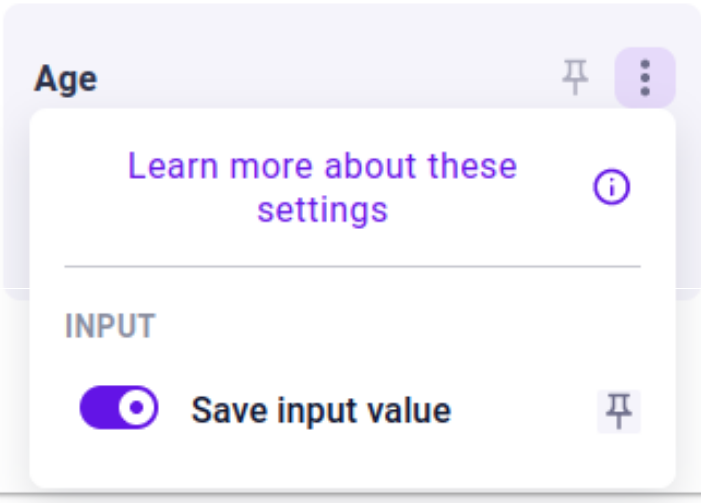

.. _uxVariableBlockAutosave:

Autosave by default
===================

  In a variable block's menu, the user has the option to toggle the "autosave" functionality.

Values entered into such variables should be stored, so that when the user returns for their next session, this variable can be pre-populated.
You can specify the default behavior using the "Autosave by default" option where appropriate.
The user can later toggle this behavior on or off.

When to use it
^^^^^^^^^^^^^^

When an input value is inherent to the user and does not change frequently (such as height, age, income, and more).
