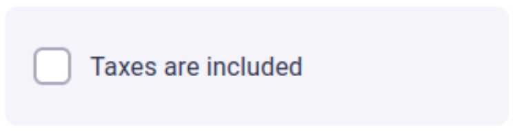
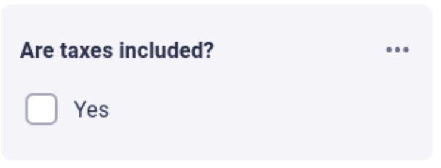

.. _uxVariableBlockLabel:

Label
=====

The label describes the variable: in the most common form, they match the quantity measured by the variable.
The label is the first and most important way the user can identify which variable does what.

When to use it
--------------

Always use labels (except checkboxes, see below).
From a UX perspective, every variable needs a label (except checkbox value selects, see below).
When writing labels, keep them short, but explanatory.
Remember that labels are used by screen readers for accessibility reasons.

.. admonition:: Example
  :class: yellow

  The variable *k* that describes a parameter that depends on the geometry of an object is better indicated by the label "Geometric parameter (k)" rather than "k".

As a **special case**, checkboxes generally don't need labels.
Instead, they should be a self-explanatory item:

  An example of a good checkbox.

  An example of a bad checkbox.

You may use a label for checkboxes in case you need to add a help text to the checkbox, or if you deem necessary to give more information to the user.

How to use it well
------------------

* Use short and informative labels wherever possible. If the label needs further description, use :ref:`help text <uxVariableBlockHelpText>`.

* Use :ref:`group <uxGroups>` names to your advantage in reducing redundant information in labels.

    For example, if you name a group "Triangle's sides" then you can simply label the variables inside it "a", "b", and "c".

* Use consistent labels and labeling styles across calculator fields. 

    For example, if your tool is about calculating the price of baking a cake, you should ideally use:

    * A group name that indicates cost, e.g. "How much will it cost?", and labels for each field, e.g. "Flour", "Eggs", "Butter" etc; OR
    * Labels "Cost of flour", "Cost of eggs", "Cost of butter".

* You can use markdown and LaTeX in labels. However, use LaTeX only if the desired output can't be obtained by regular markdown and Unicode characters.

* You can use conditional labels, but try to avoid them, in particular for verbose labels (it makes translation more complicated).

* The labels must always match what's referenced in the text. Symbols, terminology, etc. must all be consistent.

Example #1
^^^^^^^^^^

**A calculator for the cost of making a home-made skirt**

Good labels: "Cost of textile materials" or "Textile materials' cost".

Bad labels:

* "Type in the price of the materials that you will use for this project"

  * "Type in the price" is already implied action on the user's part.

  * "... the materials that you will use for this project" is redundant, since the context is already the project of making a skirt.

* "Cost" has too little information --- cost of what?

* "Textile materials" --- it's unclear what to enter based on label alone (even with a monetary field hinting at it).

  * However, this label is fine if the variable appears inside a group called "Cost of components".

Example #2
^^^^^^^^^^

**A calculator referencing three side lengths of a triangle**

Here, what makes a label good is dependent on the context of its parent group.

* If the group's name is "Triangle's sides", then labels "a", "b", and "c" are good.
* If the group is unnamed, or there is no dedicated group just for the triangle sides, then  labels "side a", "side b", "side c" might be the best option.

    This is only valid if the calculator references the fact that there's a triangle somewhere --- if not, you would have to clarify that with the group name, a text block, an image, or otherwise.
