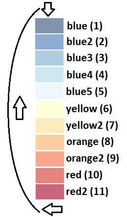
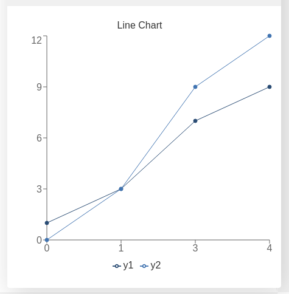
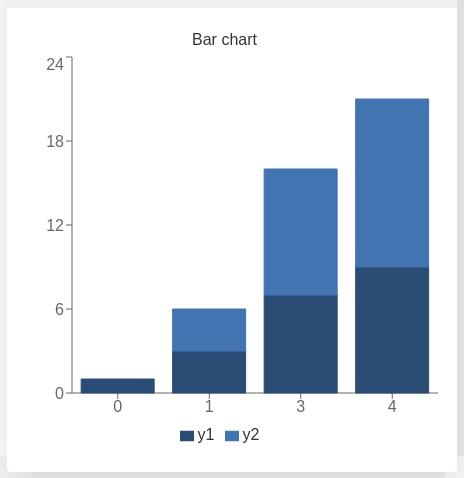
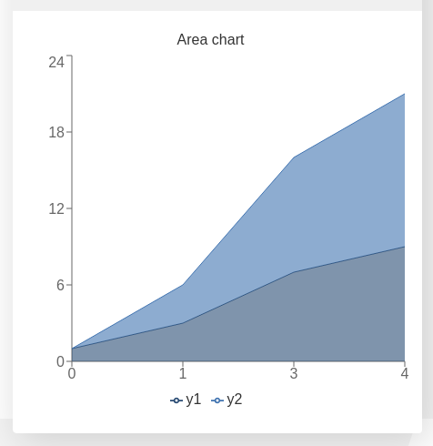
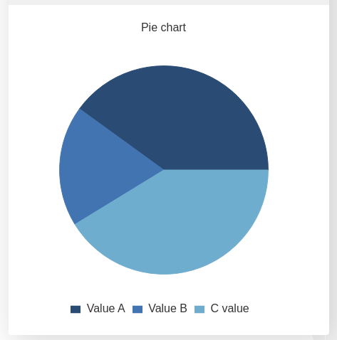

.. _addchart:
Add a Chart to the Calculator
-----------------------------

This function allows you to create and display a graph that dynamically shows multiple data points to the user. There are 4 different types of charts available for now:

#. **'line'** - Data represented as dots joined by a straight line
#. **'area'** - Similar to 'line' but without dots and the area below filled in. Allows to stack datasets on top of each other.
#. **'bar'**  - Bar chart with the ability to stack multiple datasets.
#. **'pie'**  - Pie chart where each data point represents a fraction of the total area of a circle

.. code-block:: javascript

    ctx.addChart({type: chartType,
                  data: chartData,
                  labels: dataLabels,
                  title: chartTitle,
                  stacks: stackVars,
                  afterVariable: myVar,
                  alwaysShown: aBool
                });

.. warning::

    This function only works inside a ``onResult`` context.

Each value of the key-value pair on the input is of a different type, so we need to explore each of the options in detail.

Arguments
~~~~~~~~~

The argument of this function is by far the most complicated. It is a dictionary with key-value pairs described in the table below. However, each value can be a complicated type itseld and, on top of that, not all types of charts support all the pairs. If you want to learn more about each specific type, check the below.
    
+---------------+----------------------------+----------+----------------------------------------------------------+
| Key           | valueType                  | Required | Description                                              |
+===============+============================+==========+==========================================================+
| data          | Dependant on ``type``      | Yes      | Data to be represented                                   |
+---------------+----------------------------+----------+----------------------------------------------------------+
| labels        | Array of strings           | Yes      | Labels for each of the datasets represented              |
+---------------+----------------------------+----------+----------------------------------------------------------+
| type          | string                     | Yes      | Allowed options are ``pie``, ``bar``, ``area``, ``line`` |
+---------------+----------------------------+----------+----------------------------------------------------------+
| title         | string                     | No       | Title of the chart                                       |
+---------------+----------------------------+----------+----------------------------------------------------------+
| stacks        | dictionary                 | No       | Defines which variables are stacks on top of each other  |
+---------------+----------------------------+----------+----------------------------------------------------------+
| afterVariable | string                     | No       | Location and behaviour                                   |
+---------------+----------------------------+----------+----------------------------------------------------------+
| alwaysShown   | boolean                    | No       | **false** : Text is hidden if variable is hidden //       |
|               |                            |          |  **true** : Text is always shown                          |
+---------------+----------------------------+----------+----------------------------------------------------------+

.. note::
    
    The data for the x-axis in all but ``pie`` charts is taken as a string, not as a number. The values will always appear equally distributed. All y-values are represented in order of input from left to right regardless of their associated x-values.

Colours of the datasets
~~~~~~~~~~~~~~~~~~~~~~~

Omni calculator doesn't support explicitly choosing colours for each of the datasets. The colours are assigned automatically from first to last dataset following their order in the input. The following chart represents the relation between position and colour.

.. _colorChart:

    Colour assigned to each position of data

This means that, even though you technically can, you should never display more than 11 datasets in one Omni chart. 

.. tip::

    If you want to select specific colours for your data, you can fill in you array with empty entries moving your data to the desired position. Check the detailed section for :ref:`Line Charts<lineChart>`, :ref:`Area Charts<areaChart>`, :ref:`Bar Charts<barChart>`, and :ref:`Pie Charts<pieChart>` to see a practical example for each type of chart.

Chart types and their peculiarities
~~~~~~~~~~~~~~~~~~~~~~~~~~~~~~~~~~~

Line Chart
''''''''''

This is the most straight forward version of the chart. It doesn't support ``stack`` option.

The input needs to be an array of arrays of numbers. Each array of numbers represent one data point for each dataset to be represented. The first number in the array is the `x` value (rather label) for that point and can be a string. The rest of the values must be numbers representing the `y` value of said point.

Here is an example of how ``chartData`` has to be created for this chart.

.. code-block:: javascript

    // the data represented are 4 point of the equations
    // 1st: y = 2x + 1
    // 2nd: y = 3x + 0
    var chartData = [[0, 1,  0],
                     [1, 3,  3],
                     [3, 7,  9],
                     [4, 9, 12],
                    ];

    // Now we call the function with this data
    ctx.addChart({type: 'line',
                  data: chartData,
                  labels: ['x', 'y1', 'y2'],
                  title: "Line Chart",
                  });

.. _omniChartLine:

    Line chart resulting from the data defined above

This type of chart does support stacking but it is not recommend to be used. That field need not be included in the input of the function ``addChart``.

Bar Chart
''''''''''
This function takes a similar input to the ``line`` chart, but this type of chart also supports stacking.

Here is an example of how ``chartData`` has to be created for this chart. And how to call the function ``addChart`` to stack two datasets one on top of the other

.. code-block:: javascript

    // the data represented are 4 point of the equations
    // 1st: y = 2x + 1
    // 2nd: y = 3x + 0
    var chartData = [[0, 1,  0],
                     [1, 3,  3],
                     [3, 7,  9],
                     [4, 9, 12],
                    ];

    // Now we call the function with this data
    ctx.addChart({type: 'bar',
                  data: chartData,
                  labels: ['x', 'y1', 'y2'],
                  title: "Bar Chart",
                  stacks: [{
                            columns : [1, 2] ,
                            sumLabel: "Sum of Bars"
                          }],
                  afterVariable: lastVar,
                  alwaysShown: false
                });

.. _omniChartBar:

    Bar chart resulting from the data defined above

Area Chart
'''''''''

The ``area`` chart is a hybrid between the ``line`` and the ``bar`` charts. The syntax calling and options are the same as the bar chart and the only difference when calling ``addChart`` is the obvious substitution of ``bar`` to ``line``. 

Here is the respective example:

.. code-block:: javascript

    // the data represented are 4 point of the equations
    // 1st: y = 2x + 1
    // 2nd: y = 3x + 0
    var chartData = [[0, 1,  0],
                     [1, 3,  3],
                     [3, 7,  9],
                     [4, 9, 12],
                    ];

    // Now we call the function with this data
    ctx.addChart({type: 'area',
                  data: chartData,
                  labels: ['x', 'y1', 'y2'],
                  title: "Area Chart",
                  stacks: [{
                            columns : [1, 2] ,
                            sumLabel: "Sum of Bars"
                          }],
                  });

.. _omniChartArea:                  

    Area chart resulting from the data defined above

Pie Chart
'''''''''

The input needs to be an array of dictionaries where each of the items contain two key-value pairs. The necessary keys are ``name`` representing the label of that data point and ``value`` being the numerical value of said data point.

Here is an example of how ``chartData`` has to be created for this chart.

.. code-block:: javascript

    var chartData = [{name :  ' Value A ' ,
                      value: 32
                     },
                     {name :  ' Value B ' ,
                      value: 15
                     },
                     {name :  ' C value ' ,
                      value: 33
                    }];
    ctx.addChart({type: 'pie',
                  data: chartData,
                  title: "Pie chart",
                  afterVariable: "",
                  alwaysShown: false
                });

.. _omniChartPie:

    Pie chart resulting from the data defined above

Unlike the rest of chart types, ``pie`` charts need not include labels. Stacks are also not supported.
