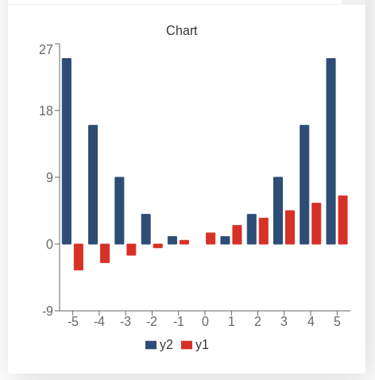

.. graphChartBasics::
.. barChart::
How to create a bar chart
=========================

We are now going to take a look at some examples as to how you would go about showing data in a chart. We have already mentioned this when talking about the :ref:`addChart<addchart>` function, but now we will take a look at how real data is created and displayed from input values.

When making a calculator the data normally has to be... calculated (surprising, right?) based on the input given by the user. Then we have the option to show this set of data as a ``line``, ``area``, ``bar`` or ``pie`` chart. To show the possibilities of each and the differences between them we have created one example specifically for each type of chart.

Practical example
-----------------

We first need to look at our example function: ``f(x) = xⁿ + offset``. We will display the data from ``x = a`` to ``x = b``. The user will input two different values for ``n`` and ``offset`` giving us the chance to show several datasets in one graph. For ``bar`` and ``area`` charts we will also show the differences between stacking and not stacking datasets.

For creating the data we will use a ``for`` loop and we will use the method ``push`` which adds a new entry at the end of an array. Our '*entry*' will be an array with the values we want to display.

Our goal here is to create a bar chart that will showcase two different functions following the form we showed above. The user will define ``n`` and ``offset`` for each of our functions. 

.. colorChart::

   Example of a bar chart with two user defined functions

We have chosen the following colours for this chart: **red** (for ``n1`` and ``offset1``) and **yellow2** (for ``n2`` and ``offset2``) which corresponds to positions **9** and **6** in the array of data [#f1]_ as shown in the :ref:`color coding in charts<colorChart>` picture we showed in a previous section

.. seealso::
    We have created a calculator using this code so that you can see the results for yourself. Check it out at `Charts (bar) <https://bb.omnicalculator.com/#/calculators/1993>`__ on BB

Code and comments
-----------------

Let's look that the example code now:

.. code-block:: javascript
    :linenos:
    :emphasize-lines: 9-13

    'use strict';

    omni.onResult(['a','b','offset','n'],function(ctx){
    var chartData = [],
        n1 = ctx.getNumberValue('n1'),
        n2 = ctx.getNumberValue('n2'),
        offset1 = ctx.getNumberValue('offset1'),
        offset2 = ctx.getNumberValue('offset2'),
        a = ctx.getNumberValue('a'),
        b = ctx.getNumberValue('b');
    for(var i = a; i <= b; i++){
        chartData.push([mathjs.format(i,2), // x-value
                        ,,,,,               // blank data to match colors
                        mathjs.pow(i, n2)+offset2, // yellow y-value
                        ,,
                        mathjs.pow(i, n1)+offset1 // first y-value
                        ]);
    }
    ctx.addChart({type: 'line',
                  labels: ['x',,,,,, 'y2',,, 'y1'],
                  data: chartData,
                  title: "Chart",
                  afterVariable: "",
                  alwaysShown: false
                });
    });

You can see here that the data is created inside a *for* loop in lines 12 to 17. Pay attention also to the empty spaces between data that allow us to get exactly the colour we want. Note that the labels need to match the position of the data in the array.

.. tip::
    For operations more complicated it might be wise to create a function to perform the operations. It will make the code cleaner and easier to understand. You might also want to look up the :ref:`Advances uses of arrays<advArray>` section or the `map method <https://www.w3schools.com/jsref/jsref_map.asp>`__.

.. rubric:: Footnotes

.. [#f1] The first position in an array is the position "**0**" (zero)
