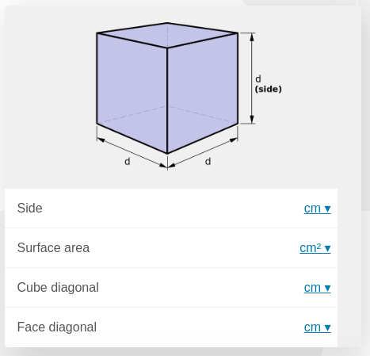

.. _dynamicImg:
Dynamic Images in Calculators
=============================

We will take a look now at **three common ways to include images** in a way that they react to the input of the user. Images in a calculator typically go at the top or at the bottom, almost never in the middle.

This is how an image looks like when put at the top.

To react to user input we need to setup conditions on which and where we set the images. We present 3 typical ways to do just that, they are by no means the only ones, but **should cover over 90% of your needs**.

.. rubric:: Methods

#. `Array method <#array-method>`__
#. `If...else method <#if-else-method>`__
#. `Name method <#name-method>`__

Array method
------------

This method is typically used to show images at the top of the calculator. For it to be applicable we need to ((be able to predict all the possible values** of the variable controlling which image we will show.

.. seealso::
    Check out the resulting calculator at `Dynamic Image (Array) <https://bb.omnicalculator.com/#/calculators/1945>`__ on BB.

This method is ideal for value selects and value setters with custom ``uid``.  In the example we use a value select for simplicity, to do the same with a value setter you need to apply the procedure to :ref:`Use a Value Setter as a Value Select <customVsetter>`.

.. code-block:: javascript
    :linenos:

    'use strict';
    /* 
        Create value setter and bind it
    */
    var aB = omni.createValueSelect({
        y:{"name":"Christmas","value":"0"},
        n:{"name":"Summer", "value":"1"},
        nY:{"name":"Summer Christmas", "value":"2"}
    });
    omni.onInit(function(ctx){
        ctx.bindValueSelect(aB, 'selection');
        ctx.setDefault('selection', 1);
    });
    /* 
        Let the magic start
    */
    omni.onResult(function(ctx){
        // Image on top - based on Value Select
        ctx.hideVariables('top');
        var imgs = ["summer.png",
                    "xmas.jpg",
                    "xmasSummer.jpg"
                    ];
        ctx.addHtml("",
                    {afterVariable: 'top'}
                    ); 
    });

.. note:: 
    You can use this method with any value but you would need to create another array or a dictionary and at that point we all wonder if it's really worth it.

To use this method you need to create an array of strings where **each item is the name of the image** you will show for the value corresponding with the position of said name.

You would then use this relationship between position of the name in the array and value of your relevant variable to **add the right name to the html text**.

.. warning::
    This method requires that you be able to predict all the possible values of the relevant variable.

If-else Method
--------------

This method is the most useful and less elegant. It is probably the one you have been using so far as it is the **most intuitive**.

Simply code your conditions and requirements in a series of ``if...else`` statements and run the function ``addHtml`` with the desired arguments.

.. seealso::
    Check out the resulting calculator at `Dynamic Image (IF ELSE) <https://bb.omnicalculator.com/#/calculators/1950>`__ on BB.

We have included a couple tricks so that **you write less text when using this method**. In short it's just setting up strings containing those parts of the html call that would be shared across all outputs.

.. code-block:: javascript
    :linenos:

    'use strict';
    omni.onResult(function(ctx){
        // Image at the bottom - based on result
        var result = ctx.getNumberValue('a');
        var htmlStart = "";
        if(result > 0){
            ctx.addHtml(htmlStart+ "positive.png"+ htmlEnd);
        }
        else if(result < 0){
            ctx.addHtml(htmlStart+ "negative.jpg"+ htmlEnd);
        }
        else if(result === 0){
            ctx.addHtml(htmlStart+ "neutral.jpeg"+ htmlEnd);
        }
    });

This is a more **flexible method** since it allows for more convoluted conditions and relations between the value of the relevant variable and the output image.

In this example the html code shared across all outputs is relatively small,
but if you need your picture to be centred, have a specific caption (or *alt*
text) it becomes **more and more useful**.

Name Method
-----------

This method is very similar to the *Array method* in concept. The main difference is that in this method you need to do a bit more **prep-work when uploading the pictures** and in return you get a simpler code to write.

.. seealso::
    Check out the resulting calculator at `Dynamic Image (Name Method) <https://bb.omnicalculator.com/#/calculators/1951>`__ on BB.

In particular your preparation will consist in anticipating what images will be paired with what values and name the files appropriately.

.. code-block:: javascript
    :linenos:

    'use strict';
    /* 
        Create value setter and bind it
    */
    var aB = omni.createValueSelect({
        y:{"name":"Christmas","value":"0"},
        n:{"name":"Summer", "value":"1"},
        nY:{"name":"Summer Christmas", "value":"2"}
    });
    omni.onInit(function(ctx){
        ctx.bindValueSelect(aB, 'selection');
        ctx.setDefault('selection', 1);
    });
    /* 
        Let the magic start
    */
    omni.onResult(function(ctx){
        // Image on top - based on Value Select
        ctx.hideVariables('top'); 
        ctx.addHtml("",
                    {afterVariable: 'top'}
                    ); 
    });

As you can see, with this method we don't need to prepare an array of names, we simply name the pictures in a way that they include the value that corresponds to them.

.. tip::
    To make it easier to find and reference your picture we recommend you follow a robust naming scheme for all your pictures. The one shown in the example consists of ``[initialsOfCalculatorian]_[initialsOfCalc]_[uniqueImgName]``.

.. warning:: 
    Just like the *array method* this method requires you to be able to predict all the possible values of the relevant variable.
