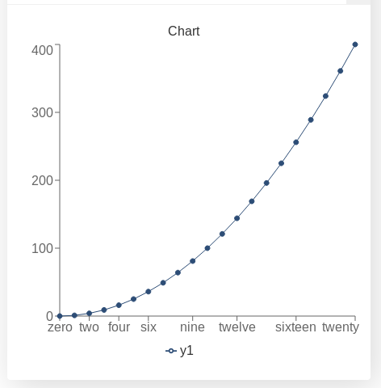

.. |ss| raw:: html

   <strike>

.. |se| raw:: html

   </strike>

.. _graphChart:
Graphs and charts (Basics)
==========================

Red for negative values (bar chart)
-----------------------------------

Limit data size (Avoid computational slow-downs)
------------------------------------------------

The code that we create in customJS is ran by the user's computer, which means we need to be mindful of the resources we are taking in the computation process. A good rule of thumb is that for every thousand iterations in customJS an average computer would take approximately 1sec [#f1]_. 

You will have to make the final call yourself as to how many points your chart needs, but you really shouldn't go over 10000 points as it will take so much time that it will trigger an error message in the browser. 

To prevent users from creating charts with too many points there are several strategies. One of them is simply to limit the maximum number the user can input with a simple condition like in the `Binomial Distribution <https://bb.omnicalculator.com/#/calculators/461>`__ 

There are also ways to allow any input values while keeping the number of points in the graph under control. We will show here the simplest way to define a constant number of steps that will be independent of the input parameters.

.. seealso::
    We have created a calculator using this code so that you can see the results for yourself. Check it out at `Dynamic Graph (number of points) <https://bb.omnicalculator.com/#/calculators/1968>`__ on BB

Let's look at the code now:

.. code-block:: javascript
    :linenos:
    :emphasize-lines: 9, 10

    'use strict';
    omni.onResult(['a','b','offset','n'],function (ctx){
        var chartData = [],
            n = ctx.getNumberValue('n'),
            a = ctx.getNumberValue('a'),
            b = ctx.getNumberValue('b'),
            offset = ctx.getNumberValue('offset'),
            nSteps = ctx.getNumberValue( 'nSteps'),
            iterStep = mathjs.abs(a-b)/(nSteps-1);
        for(var i = a; i <= b; i += iterStep){
            chartData.push([mathjs.format(i,2), // x-value
                            mathjs.pow(i, n)+offset // y-value
                          ]);
        }
        ctx.addChart({type: 'line', 
                      labels: ['x', 'y1'], 
                      data: chartData,
                      title: "Chart",
                      afterVariable: "",
                      alwaysShown: false 
                    });
    });

The relevant lines have been highlighted, in them we first define an iteration step, based on number of steps we want, and then we use that iteration step in out ``for`` loop. Adding the *"or equal"* part of the condition in the loop and using ``nSteps-1`` guarantees we will have exactly the number of points we want.

.. note:: 
    In this calculator ``nStep`` can be changed by the user in *Advanced Mode* only so that we can easily interact with it. In most calculators this number will be hard-set by the calculatorian in the code.

A word on user defined chart type
---------------------------------

Another useful think in certain calculators could be letting the user decide what type of chart they prefer. This only works for  ``line``, ``area`` and ``bar`` charts, since ``pie`` charts use a different data format.

.. seealso::
    We have created a calculator using this code so that you can see the results for yourself. Check it out at `Dynamic Graphs (chart types) <https://bb.omnicalculator.com/#/calculators/1969>`__ on BB

Let's take a look at an example:

.. code-block:: javascript
    :linenos:
    :emphasize-lines: 3-12, 28-31

    'use strict';

    var aB = omni.createValueSelect({
        y: {"name":"line","value":"0"},
        yN:{"name":"area","value":"1"},
        nY:{"name":"bar" ,"value":"2"},
        n: {"name":"pie" ,"value":"4"}
    });
    omni.onInit(function(ctx){
        ctx.bindValueSelect(aB, 'chartType');
        ctx.setDefault('chartType', "0");
    });

    omni.onResult(['a','b','offset','n'],function(ctx){
        var chartData = [],
            n = ctx.getNumberValue('n'),
            a = ctx.getNumberValue('a'),
            b = ctx.getNumberValue('b'),
            offset = ctx.getNumberValue('offset'),
            iterStep = mathjs.abs(a-b)/99,
            chartType = ctx.getNumberValue('chartType'),
            chartName = ['line', 'area', 'bar', 'pie'];
        for(var i = a; i <= b; i += iterStep){
            chartData.push([mathjs.format(i,2), // x
                            mathjs.pow(i, n)+offset // y
                            ]);
            }
        if(chartType == 4){
            ctx.addHtml('The <strike>CAKE</strike> pie is a lie');
        }else{
            ctx.addChart({type: chartName[chartType],
                        labels: ['x', 'y1'],
                        data: chartData,
                        title: "Chart",
                        afterVariable: "",
                        alwaysShown: false
                        });
        }
    });

As you can see in the example above, the user is given a value select so that he can chose which chart is best for the data. We have taken into account that ``pie`` option will give out an error and decided to show a message instead of letting the calculator crash.

.. warning::
    If you let the user select the type of chart, make sure the data will be in the correct format. In the example we have left the option ``pie`` in the value select for educational purposes, but you don't need to.

Remember that this is just an example, you should feel free to create your own conditions an behaviours. Each chart can represent different variations of the data or use different colours.

.. tip:: 
    It is better to give less options to the user than to show error messages.  In this example, the best procedure will be to disable the option ``pie`` on the value select.

Custom labels (x-axis)
----------------------

We will now look at a little special |ss| problem |se| feature of our charts: the x-axis. Our charts do not process the data on the x-axis. The data on the x-axis is treated as a label only and the data on the y-axis is assumed to be equally spaced. 

This is generally a handicap, but it can be turned around by using strings as x-data.

.. seealso::
    We have created a calculator using this code so that you can see the results for yourself. Check it out at `Dynamic Graphs (X-axis) <https://bb.omnicalculator.com/#/calculators/1970>`__ on BB

The code for this example is rather long due to the setup process, so it will
be omitted from the documentation. Instead, we will show you an image of what
it would would like when using non-standard numerical values:

.. _xAxis:

    Example of custom values for the x-axis

This options can come in handy when trying to display time on the x-axis. You can use the functions in our repository to `Play with time <https://github.com/AlGepe/OmniSnippets_JS/tree/master/Code/PlayingWithTime>`__ formats and make your chart easier to understand. For example, instead of showing the years as a decimal number you can display also the name of the month.

Stack is broken (mostly) so make your own
-----------------------------------------
.. rubric:: Footnotes

.. [#f1] The relationship is not necessarily linear. Tested on an Intel i5-3320M CPU @ 2.60GHz processor from 2012.
