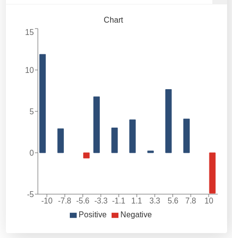

.. |ss| raw:: html

   <strike>

.. |se| raw:: html

   </strike>

.. _graphChart:
Graphs and charts (Extra)
==========================

It is now time to take a look at some more advanced ways to use the ``addChart`` function. In this section we will cover a couple common ways to get more functionality out of charts as well as tackle some issues that can arise when using them.  

.. toctree::
    graphChart.rst

Limit data size (Avoid computational slow-downs)
------------------------------------------------

The code that we create in customJS is ran by the user's computer, which means we need to be mindful of the resources we are taking in the computation process. A good rule of thumb is that for every thousand iterations in customJS an average computer would take approximately 1sec [#f1]_. 

You will have to make the final call yourself as to how many points your chart needs, but you really shouldn't go over 10000 points as it will take so much time that it will trigger an error message in the browser. 

To prevent users from creating charts with too many points there are several strategies. One of them is simply to limit the maximum number the user can input with a simple condition like in the `Binomial Distribution <https://bb.omnicalculator.com/#/calculators/461>`__ 

There are also ways to allow any input values while keeping the number of points in the graph under control. We will show here the simplest way to define a constant number of steps that will be independent of the input parameters.

.. seealso::
    We have created a calculator using this code so that you can see the results for yourself. Check it out at `Dynamic Graph (number of points) <https://bb.omnicalculator.com/#/calculators/1968>`__ on BB

Let's look at the code now:

.. code-block:: javascript
    :linenos:
    :emphasize-lines: 9, 10

    'use strict';
    omni.onResult(['a','b','offset','n'],function (ctx){
        var chartData = [],
            n = ctx.getNumberValue('n'),
            a = ctx.getNumberValue('a'),
            b = ctx.getNumberValue('b'),
            offset = ctx.getNumberValue('offset'),
            nSteps = ctx.getNumberValue( 'nSteps'),
            iterStep = mathjs.abs(a-b)/(nSteps-1);
        for(var i = a; i <= b; i += iterStep){
            chartData.push([mathjs.format(i,2), // x-value
                            mathjs.pow(i, n)+offset // y-value
                          ]);
        }
        ctx.addChart({type: 'line', 
                      labels: ['x', 'y1'], 
                      data: chartData,
                      title: "Chart",
                      afterVariable: "",
                      alwaysShown: false 
                    });
    });

The relevant lines have been highlighted, in them we first define an iteration step, based on number of steps we want, and then we use that iteration step in out ``for`` loop. Adding the *"or equal"* part of the condition in the loop and using ``nSteps-1`` guarantees we will have exactly the number of points we want.

.. note:: 
    In this calculator ``nStep`` can be changed by the user in *Advanced Mode* only so that we can easily interact with it. In most calculators this number will be hard-set by the calculatorian in the code.

A word on user defined chart type
---------------------------------

Another useful think in certain calculators could be letting the user decide what type of chart they prefer. This only works for  ``line``, ``area`` and ``bar`` charts, since ``pie`` charts use a different data format.

.. seealso::
    We have created a calculator using this code so that you can see the results for yourself. Check it out at `Dynamic Graphs (chart types) <https://bb.omnicalculator.com/#/calculators/1969>`__ on BB

Let's take a look at an example:

.. code-block:: javascript
    :linenos:
    :emphasize-lines: 3-12, 28-31

    'use strict';

    var aB = omni.createValueSelect({
        y: {"name":"line","value":"0"},
        yN:{"name":"area","value":"1"},
        nY:{"name":"bar" ,"value":"2"},
        n: {"name":"pie" ,"value":"4"}
    });
    omni.onInit(function(ctx){
        ctx.bindValueSelect(aB, 'chartType');
        ctx.setDefault('chartType', "0");
    });

    omni.onResult(['a','b','offset','n'],function(ctx){
        var chartData = [],
            n = ctx.getNumberValue('n'),
            a = ctx.getNumberValue('a'),
            b = ctx.getNumberValue('b'),
            offset = ctx.getNumberValue('offset'),
            iterStep = mathjs.abs(a-b)/99,
            chartType = ctx.getNumberValue('chartType'),
            chartName = ['line', 'area', 'bar', 'pie'];
        for(var i = a; i <= b; i += iterStep){
            chartData.push([mathjs.format(i,2), // x
                            mathjs.pow(i, n)+offset // y
                            ]);
            }
        if(chartType == 4){
            ctx.addHtml('The <strike>CAKE</strike> pie is a lie');
        }else{
            ctx.addChart({type: chartName[chartType],
                        labels: ['x', 'y1'],
                        data: chartData,
                        title: "Chart",
                        afterVariable: "",
                        alwaysShown: false
                        });
        }
    });

As you can see in the example above, the user is given a value select so that he can chose which chart is best for the data. We have taken into account that ``pie`` option will give out an error and decided to show a message instead of letting the calculator crash.

.. warning::
    If you let the user select the type of chart, make sure the data will be in the correct format. In the example we have left the option ``pie`` in the value select for educational purposes, but you don't need to.

Remember that this is just an example, you should feel free to create your own conditions an behaviours. Each chart can represent different variations of the data or use different colours.

.. tip:: 
    It is better to give less options to the user than to show error messages.  In this example, the best procedure will be to disable the option ``pie`` on the value select.

Custom labels (x-axis)
----------------------

We will now look at a little special |ss| problem |se| feature of our charts: the x-axis. Our charts do not process the data on the x-axis. The data on the x-axis is treated as a label only and the data on the y-axis is assumed to be equally spaced. 

This is generally a handicap, but it can be turned around by using strings as x-data.

.. seealso::
    We have created a calculator using this code so that you can see the results for yourself. Check it out at `Dynamic Graphs (X-axis) <https://bb.omnicalculator.com/#/calculators/1970>`__ on BB

The code for this example is rather long due to the setup process, so it will
be omitted from the documentation. Instead, we will show you an image of what
it would would like when using non-standard numerical values:

.. _xAxis:
.. figure:: xAxis.png
    :scale: 70%
    :alt: Alternative values on X-axis
    :align: center

    Example of custom values for the x-axis

This options can come in handy when trying to display time on the x-axis. You can use the functions in our repository to `Play with time <https://github.com/AlGepe/OmniSnippets_JS/tree/master/Code/PlayingWithTime>`__ formats and make your chart easier to understand. For example, instead of showing the years as a decimal number you can display also the name of the month.

Red for negative values
-----------------------

A useful trick for charts is to show different parts of the data in different colours. It could show important or special parts of the data and can help with the visualisation since none of the charts show clearly what is the origin of coordinates.

One way to apply this, specially useful in finance, is to show negative values in red. For that, all we need to do is define the order in which the data is placed on the array according to its value. 

.. _redNegIMG:


   Example of a bar chart with negative values in red

.. seealso::
    We have created a calculator using this code so that you can see the results for yourself. Check it out at `Dynamic Graph (number of points) <https://bb.omnicalculator.com/#/calculators/1968>`__ on BB

For our example we have chose a function that goes above and below 0 (zero) fairly often: ``f(x) = cos(x)*x+offset1`` from ``x=a``` to ``x=b``. The values of ``a``, ``b``, and ``offset1`` being defined by the user.

Let's see the code:

.. code-block:: javascript
    :linenos:
    :emphasize-lines: 16-23

    'use strict';

    omni.onResult(['a','b','offset1'],function(ctx){
    var chartData = [],
        n1 = ctx.getNumberValue('n1'),
        n2 = ctx.getNumberValue('n2'),
        offset1 = ctx.getNumberValue('offset1'),
        offset2 = ctx.getNumberValue('offset2'),
        a = ctx.getNumberValue('a'),
        b = ctx.getNumberValue('b'),
        onePoint =[],
        yValue,
        nSteps = 10,
        iterStep = mathjs.abs(a-b)/(nSteps-1);

    for(var i = a; i <= b; i += iterStep){  
        yValue = mathjs.round(mathjs.cos(i)*i+offset1, 2);
        if(yValue >= 0){ 
            onePoint = [mathjs.format(i,2), yValue];
        }
        else{
            onePoint = [mathjs.format(i,2),,,,,,,,,, yValue]; 
        }
        chartData.push(onePoint);
    }
        ctx.addChart({type: 'bar',
                      labels: ['x', 'Positive',,,,,,,,, 'Negative'],
                      data: chartData,
                      title: "Chart",
                      afterVariable: "",
                      alwaysShown: false 
                    });
    });

You can see here that the value of the function is stored in a different position in the array depending on its value. This corresponds to a different colour.

One of the downsides of this method are the fact that the bars are half as wide as they would be on their own. Another downside is the need for 2 different labels.

This can be performed with any type of chart (except ``pie``). It has been exemplified in a ``bar`` chart since this is the best fit.

.. _brokenStacking:
Stack a.k.a. playing Jenga in customJS
--------------------------------------

.. rubric:: 
    NOT BROKEN, JUST THE SAME AS WITH PIE CHART => SIMILAR COLOURS || BROKEN
    LEGEND (pick your poison)

When it comes to the ``stacks`` option, it is finicky at best. It is very similar to playing *Jenga* you can technically do anything, and there are tons of possibilities on what you can do... But realistically you're going to take the piece that is loose and put it on top in the safest way possible 

With *stacking* you face the same situation, you will only use it in a very specific situation. Stacking requires at least 2 datasets. What this option does is take the first dataset and using it as the 0-level for the second dataset effectively showing the sum of both. In other words: *it stacks the data sets on top of each other*.

The problems can appear when we want to do something fancy instead of *stacking* 2 variables places in the first two positions in the array. Allow me to explain by taking a look at some scenarios:

.. rubric:: Consecutive data stacked on top of each other (Works)

Let's look at a fully working example first:

.. code-block:: javascript
    :linenos:

    'use strict';

    omni.onResult(['a','b','offset1'],function(ctx){
    var chartData = [],
        offset1 = ctx.getNumberValue('offset1'),
        a = ctx.getNumberValue('a'),
        b = ctx.getNumberValue('b'),
        onePoint =[],
        y1, y2, y3,
        nSteps = 50,
        iterStep = mathjs.abs(a-b)/(nSteps-1);
    for(var i = a; i <= b; i += iterStep){  
        y1 = mathjs.round(mathjs.sin(i)+offset1, 2);
        y2 = mathjs.round(mathjs.cos(i)*i/5+offset1, 2);
        y3 = mathjs.round(mathjs.tan(mathjs.sin(i+2))+offset1, 2);
        onePoint = [mathjs.format(i,2), y1, y2, y3];
        chartData.push(onePoint);
    }
    ctx.addChart({type: 'area',
                  labels: ['x','y1','y2','y3'],
                  data: chartData,
                  stacks: [{columns : [1,2,3] ,sumLabel: "Sum of Bars"}],
                  title: "Chart",
                  afterVariable: "",
                  alwaysShown: false
                });
    });

In this example the dataset ``y3`` is stack on top of ``y2`` which is also stack on top of ``y1``. The scenario works without a problem and the only concern here should be order of datasets.  

The stacking order is given by the position in the ``chartData`` array and not in the ``column`` options. Also note that if the sum of the stacking variables is 0 (zero) you will still see data from the first dataset, but not from the second one.

.. rubric:: Data stacked with contrasting colours (Doesn't work)

We will show only the part of the code that differs from the previous example:

.. code-block:: javascript
    :lineno-start: 15
    
    [..]
        onePoint = [mathjs.format(i,2), y1,,,,,, y2,,, y3];
        chartData.push(onePoint);
    }
    ctx.addChart({type: 'area',
                  labels: ['x','y1',,,,,,'y2',,,'y3'],
                  data: chartData,
                  stacks: [{columns : [1,7,10] ,sumLabel: "Sum of Bars"}],
                    [..]

This is an example of what you might try at first if you want to have stacked
datasets in totally different colours. However, having empty data causes an
error. 

This is a tricky error since the data is shown without at problem, but the
chart crashes the calculator the moment you try to hover the mouse over it.

This fatal error makes this trick unusable

A workaround would be to fill the rest of the positions in the array with
meaningless data, with the value 0 (zero) for example. To do that you'd use
code like this:

.. code-block:: javascript
    :lineno-start: 15
    
    [..]
        onePoint = [mathjs.format(i,2), y1,0,0,0,0,0, y2,0,0, y3];
        chartData.push(onePoint);
    }
    ctx.addChart({type: 'area',
                  labels: ['x','y1',' ',' ',' ',' ',' ','y2',' ',' ','y3'],
                  data: chartData,
                  stacks: [{columns : [1,7,10] ,sumLabel: "Sum of Bars"}],
                    [..]

However, just like with the :ref:`pie Chart<pieChart>` the legend will show all
the empty colour options and hovering your mouse will bring up a list of mostly
0-value data. 


.. rubric:: The workaround that works (around)

Here is an example of how you can make your own stacked charts without using
the ``stacks`` option.

.. code-block:: javascript
    :linenos:

    'use strict';

    omni.onResult(['a','b','offset1'],function(ctx){
    var chartData = [],
        offset1 = ctx.getNumberValue('offset1'),
        a = ctx.getNumberValue('a'),
        b = ctx.getNumberValue('b'),
        onePoint =[],
        y1, y2, y3,
        nSteps = 50,
        iterStep = mathjs.abs(a-b)/(nSteps-1);
    for(var i = a; i <= b; i += iterStep){  
      y3 = mathjs.round(mathjs.tan(mathjs.sin(i+2))+offset1, 2)/3;
      y2 = mathjs.round(mathjs.cos(i)*i/5+offset1, 2);
      onePoint = [mathjs.format(i,2),, y2, y3];
      onePoint = [mathjs.format(i,2),,y2,,,,,,y2+y3,,, y3];
      chartData.push(onePoint);
    }
    ctx.addChart({type: 'area',
                  labels: ['x',,'y2',,,,,,'y2+y3',,,'y3'],
                  data: chartData,
                  title: "Chart",
                  afterVariable: "",
                  alwaysShown: false
                });
    });

Using this trick we have been able to combine ``y2`` in blue and ``y3`` in dark red to create ``y2+y3`` in orange. The only downside being that for a ``bar`` chart this trick doesn't really stack the datasets but rather create a new bar that is the sum of both. I guess nothing is perfect in this world

.. tip::
    If you want to do stacking in a ``line`` chart use this trick.

.. rubric:: Footnotes

.. [#f1] The relationship is not necessarily linear. Tested on an Intel i5-3320M CPU @ 2.60GHz processor from 2012.
