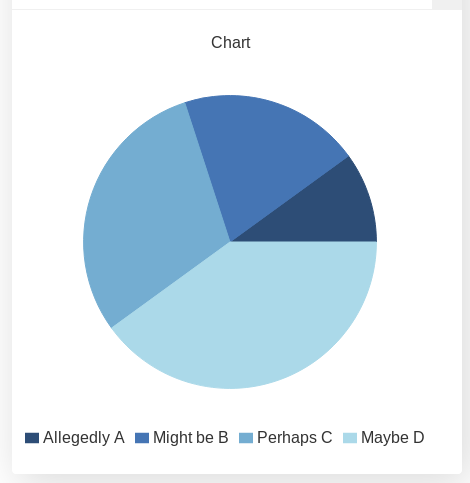
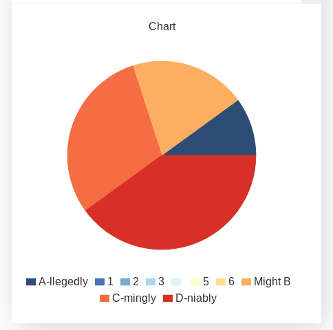

.. _pieChart:
Hot to create a pie Chart
=========================

In this section we will show you how to create a **Pie Chart**. We already created a simple example in :ref:`addChart<addchart>`, but now we will take a look at how real data is created and displayed from input values.

When making a calculator the data normally has to be... calculated (surprising, right?) based on the input given by the user. Then we have the option to show this set of data as a ``line``, ``area``, ``bar`` or ``pie`` chart. To show the possibilities of each and the differences between them we have created one example specifically for **each type of chart**.

Practical example
-----------------

The pie chart is a very different chart to ``bar``, ``area`` and ``line`` charts both in terms of the **type of data it requires and in the way it displays** such information. Pie charts don't show change over time (or any other variable) they simply represent graphically the **proportionality between different variables.** 

For our example we have 4 variables, whose value is set by the user directly. We then represent them in a pie chart where the total area of the circle (a.k.a.  pie) is the sum of all the variables. The **area of each variable is proportional to its value**.

.. _pieChartIMG:

   Example of a pie chart with 4 user defined values

Unfortunatelly we don't really get to chose colors in a ``pie`` chart, eventhough the possibility is technically there. We will see more after the example code.

.. seealso::
    We have created a calculator using this code so that you can see the results for yourself. Check it out at `Charts (pie) <https://bb.omnicalculator.com/#/calculators/1992>`__ on BB

Code and comments
-----------------

Let's look that the example code now:

.. code-block:: javascript
    :linenos:
    :emphasize-lines: 4-9

    'use strict';

    omni.onResult(['tots'],function(ctx){
        var chartData = [{name: 'A-llegedly', value: ctx.getNumberValue('a')},
                         //{},{},{},{name:''},{},{},
                         {name: 'Might B' , value: ctx.getNumberValue('b')},
                         {name: 'C-mingly', value: ctx.getNumberValue('c')},
                         {name: 'D-niably', value: ctx.getNumberValue('d')},
                        ]; 
        ctx.addChart({type: 'pie',
                      data: chartData,
                      title: "Chart",
                      afterVariable: "",
                      alwaysShown: false
                    });
    });
    
We have mentioned before the inability to select colours in a ``pie`` chart.  The reason is that when we create empty data, an entry gets added to the legend. So we have to chose between a legend that doesn't make sense or a fixed order of colours. We **do recommend** to settle for the later.

You can **see the effect** of empty values on both the legend and the colours
of the chart by uncommenting line *5* in the calculator. Here is a preview:

   Example of using custom colours on a pie chart
