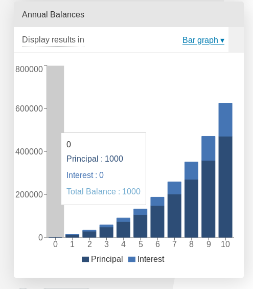

.. _brokenStacking:
Stack a.k.a. playing Jenga in customJS
======================================

When it comes to the ``stacks`` option, it is finicky at best. It is very similar to playing *Jenga* you can technically do anything, and there are tons of possibilities... But realistically you're going to **take the piece that is loose and put it on top in the safest way possible**.

With *stacking* you face the same situation, you will only use it in a very specific situation. Stacking requires at least 2 datasets. What this option does is **take the first dataset and using it as the 0-level for the second** dataset effectively showing the sum of both. In other words: *it stacks the data sets on top of each other*.

The problems can appear when we want to do something fancy instead of *stacking* 2 variables placed in the first two positions in the array. Allow me to explain by taking a look at some scenarios:

Expected use case or how to make it work
---------------------------------------

Before we get into the problems that might arise when doing strange combinations, we need to take a look at how it actually works in the **expected scenario**.

For example, here is a real-world example taken from the `Investment Calculator <https://www.omnicalculator.com/finance/investment>`__ by Tibor:

.. _lineChartIMG:

   Example of a data stack on top of each other.

And this is how you would write the customJS to take advantage of ``stacks``:

.. code-block:: javascript
    :linenos:

    'use strict';

    omni.onResult(['a','b','offset1'],function(ctx){
    var chartData = [],
        offset1 = ctx.getNumberValue('offset1'),
        a = ctx.getNumberValue('a'),
        b = ctx.getNumberValue('b'),
        onePoint =[],
        y1, y2, y3,
        nSteps = 50,
        iterStep = mathjs.abs(a-b)/(nSteps-1);
    for(var i = a; i <= b; i += iterStep){  
        y1 = mathjs.round(mathjs.sin(i)+offset1, 2);
        y2 = mathjs.round(mathjs.cos(i)*i/5+offset1, 2);
        y3 = mathjs.round(mathjs.tan(mathjs.sin(i+2))+offset1, 2);
        onePoint = [mathjs.format(i,2), y1, y2, y3];
        chartData.push(onePoint);
    }
    ctx.addChart({type: 'area',
                  labels: ['x','y1','y2','y3'],
                  data: chartData,
                  stacks: [{columns : [1,2,3] ,sumLabel: "Sum of Bars"}],
                  title: "Chart",
                  afterVariable: "",
                  alwaysShown: false
                });
    });

In this example the dataset ``y3`` is stacked on top of ``y2`` which is also stacked on top of ``y1``. The scenario works without a problem and the only concern here should be the **order of datasets**.

The stacking order is given by the position in the ``chartData`` array and not in the ``column`` options. Also note that if the sum of the stacking variables is 0 (zero) you will **still see data from the first dataset**, but not from the second one.

Data stacked with contrasting colours (Doesn't work)
----------------------------------------------------

We will show only the part of the code that differs from the previous example:

.. code-block:: javascript
    :lineno-start: 15
    
    [..]
        onePoint = [mathjs.format(i,2), y1,,,,,, y2,,, y3];
        chartData.push(onePoint);
    }
    ctx.addChart({type: 'area',
                  labels: ['x','y1',,,,,,'y2',,,'y3'],
                  data: chartData,
                  stacks: [{columns : [1,7,10] ,sumLabel: "Sum of Bars"}],
                    [..]

This is an example of what you might **try at first if you want to have stacked datasets in totally different colours**. However, having empty data causes an error. 

This is a tricky error since the data is shown without at problem, but the chart crashes the calculator the moment you try to hover the mouse over it.

This fatal error makes this trick **unusable**.

A **workaround would be to fill the rest** of the positions in the array with meaningless data, with the value 0 (zero) for example. To do that you'd use code like this:

.. code-block:: javascript

    :lineno-start: 15
    
    [..]
        onePoint = [mathjs.format(i,2), y1,0,0,0,0,0, y2,0,0, y3];
        chartData.push(onePoint);
    }
    ctx.addChart({type: 'area',
                  labels: ['x','y1',' ',' ',' ',' ',' ','y2',' ',' ','y3'],
                  data: chartData,
                  stacks: [{columns : [1,7,10] ,sumLabel: "Sum of Bars"}],
                    [..]

However, just like with the :ref:`pie Chart<pieChart>` the legend will show all the empty colour options and hovering your mouse will bring up a list of mostly 0-value data. 

The workaround that works (around)
----------------------------------

Here is an example of how you can make your own stacked charts without using the ``stacks`` option. The concept is very simple: just **Do it yourself!**

.. code-block:: javascript
    :linenos:

    'use strict';

    omni.onResult(['a','b','offset1'],function(ctx){
    var chartData = [],
        offset1 = ctx.getNumberValue('offset1'),
        a = ctx.getNumberValue('a'),
        b = ctx.getNumberValue('b'),
        onePoint =[],
        y1, y2, y3,
        nSteps = 50,
        iterStep = mathjs.abs(a-b)/(nSteps-1);
    for(var i = a; i <= b; i += iterStep){  
      y3 = mathjs.round(mathjs.tan(mathjs.sin(i+2))+offset1, 2)/3;
      y2 = mathjs.round(mathjs.cos(i)*i/5+offset1, 2);
      onePoint = [mathjs.format(i,2),, y2, y3];
      onePoint = [mathjs.format(i,2),,y2,,,,,,y2+y3,,, y3];
      chartData.push(onePoint);
    }
    ctx.addChart({type: 'area',
                  labels: ['x',,'y2',,,,,,'y2+y3',,,'y3'],
                  data: chartData,
                  title: "Chart",
                  afterVariable: "",
                  alwaysShown: false
                });
    });

Using this trick we have been able to combine ``y2`` in blue and ``y3`` in dark red to create ``y2+y3`` in orange. The only downside being that for a ``bar`` chart this trick **doesn't really stack the datasets but rather create a new bar that is the sum of both**. I guess nothing is perfect in this world.

.. tip::
    If you want to do stacking in a ``line`` chart use this trick.

An open playground (Jenga provided)
-----------------------------------

As a fan of jenga yourself (don't try to say otherwise, **you are**) I'm sure
you're eager to play Jenga in customJS. Don't worry, we have you covered.

Here is the calculator for stacking and playing with *Jenga*, feel free to test
your own combinations.

.. seealso::
    Jenga/Stack calculator is available as `Charts (Jenga)
    <https://bb.omnicalculator.com/#/calculators/1999>`__ in BB.
